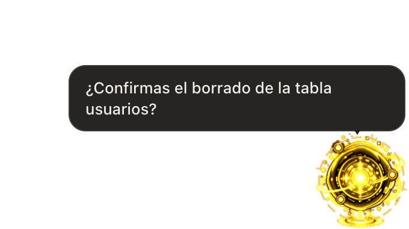
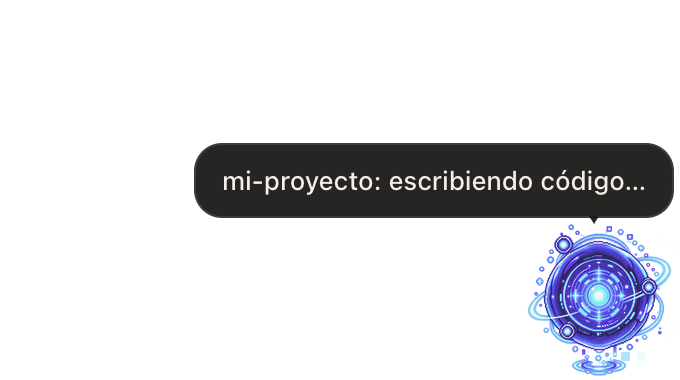
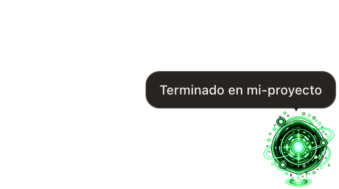
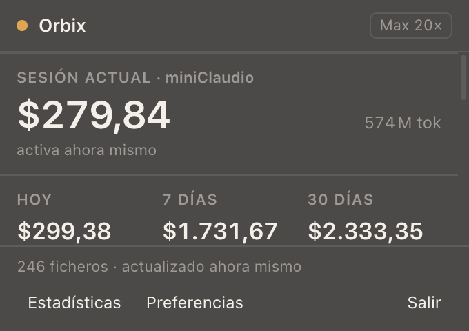
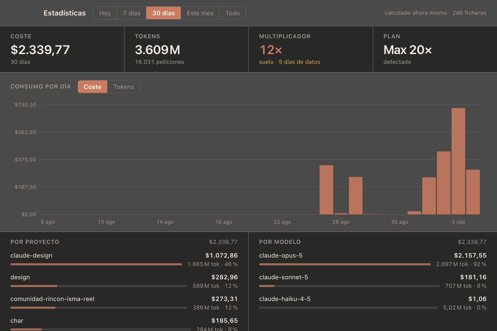

# Orbix

Una mascota de escritorio para macOS que reacciona en tiempo real a lo que hace [Claude Code](https://claude.com/claude-code) y lleva la cuenta de tokens, coste y límites de tu suscripción.

> **Orbix no es un producto oficial de Anthropic ni está afiliado con Claude Code.** Es una herramienta independiente que se conecta a Claude Code mediante su sistema de hooks, documentado y soportado públicamente.

<p align="center">
  
  
  
</p>
<p align="center">
  
  
</p>
<p align="center"><em>Más capturas, de cada pantalla: <a href="docs/manual/MANUAL.md">manual de usuario</a>.</em></p>

## Qué hace

- **Avisa** — un núcleo de energía en una esquina de tu pantalla cambia de tinte y ritmo según lo que Claude Code está haciendo (pensando, escribiendo código, ejecutando comandos, esperando tu respuesta) y te lo cuenta en un bocadillo.
- **Cuenta** — un menubar con los tokens consumidos y el coste equivalente a tarifas de API, de la sesión, hoy, 7 días y 30 días, más el multiplicador contra el precio de tu plan.
- **Vigila los límites** — barras de uso de tu ventana de 5 horas y tu semana, con la antigüedad del dato siempre visible: nunca se presenta un porcentaje viejo como si fuera actual.

Todo el procesamiento ocurre **en tu máquina**. Ver [Privacidad](#privacidad) más abajo.

## Instalación

### Homebrew (recomendado)

```sh
brew install --cask icatala/orbix/orbix
```

### Con un agente

¿Tienes Claude Code (u otro agente con acceso a terminal) a mano? Cópiale este prompt y que instale Orbix por ti — comprueba requisitos, instala, arranca y verifica que todo funciona solo, y se detiene justo antes de tocar tu configuración de Claude Code para que ese paso lo confirmes tú:

**→ [Instalación con un agente](docs/manual/AGENT_INSTALL.md)**, prompt listo para copiar y pegar.

### DMG manual

Descarga la última versión desde [Releases](../../releases). Orbix **no está firmado ni notarizado** por Apple todavía, así que la primera vez que lo abras macOS mostrará un aviso. Es normal en software independiente sin firmar: haz clic derecho sobre `Orbix.app` → **Abrir**, y confirma en el diálogo. Solo hace falta la primera vez.

### Requisitos

- macOS 13 o superior, Apple Silicon (arm64).
- [Claude Code](https://claude.com/claude-code) instalado y en uso.

## Primeros pasos

Al abrir Orbix por primera vez verás la mascota y el icono en la barra de menús, contando ya tu histórico de tokens (Orbix lee los transcripts que Claude Code guarda en `~/.claude/projects`). Para que también **reaccione** a lo que Claude Code hace en tiempo real, abre **Preferencias → Integración** e instala los hooks — Orbix te explica exactamente qué va a modificar antes de tocar nada, y hace una copia de seguridad de tu configuración.

Guía completa, con capturas de cada pantalla: **[Manual de usuario](docs/manual/MANUAL.md)**.

## Privacidad

- Todo vive en tu Mac: una base de datos SQLite local (`~/Library/Application Support/Orbix`) y nada más. Sin servidor, sin telemetría, sin analítica.
- Orbix lee `~/.claude/projects` (tus transcripts), `~/.claude.json` (tu plan y límites) y, si instalas los hooks, recibe eventos de Claude Code por un servidor HTTP que **solo escucha en `127.0.0.1`**.
- La instalación de hooks modifica `~/.claude/settings.json`. Nunca se hace sin tu confirmación explícita, se hace una copia de seguridad antes, y cualquier hook que ya tuvieras configurado (de otras herramientas) se conserva intacto.
- El **refresco automático de límites** (Preferencias → Datos, desactivado por defecto) ejecuta periódicamente `claude -p "/usage"` — el comando oficial de Claude Code — para tener el porcentaje de uso al día. Cada ejecución consume una petición real de tu suscripción; por eso es opcional y con un intervalo mínimo de un minuto.
- Nada de lo anterior sale de tu máquina hacia ningún servidor de Orbix, porque Orbix no tiene servidor: es una app de escritorio, punto.

## Desinstalar

Desde **Preferencias → Integración**, desinstala los hooks (deja tu `settings.json` como estaba). Luego arrastra `Orbix.app` a la papelera. Tu histórico en `~/Library/Application Support/Orbix` no se borra solo, por si quieres conservarlo o consultarlo aparte; bórralo a mano si no lo necesitas.

## Actualizar

- **Ya tienes Orbix instalado** y quieres la versión más reciente: `brew upgrade --cask orbix`, o vuelve a descargar el DMG. Detalle en el [manual de actualización](docs/manual/UPDATING.md#1-para-quien-usa-orbix).
- **Vas a publicar una versión nueva** del proyecto: el proceso completo, paso a paso y probado, está en el [manual de actualización](docs/manual/UPDATING.md#2-para-quien-publica-una-versión-nueva).

## Licencia

Código disponible para lectura y referencia, todos los derechos reservados — ver [LICENSE](LICENSE). La aplicación compilada es de descarga y uso libre para fines personales por los canales oficiales.
