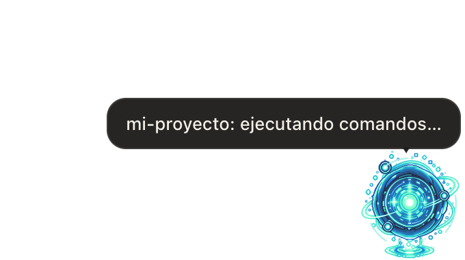
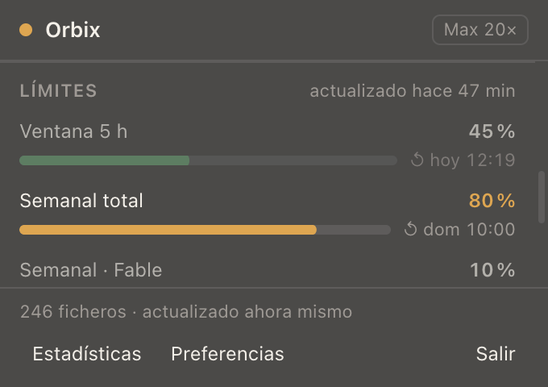
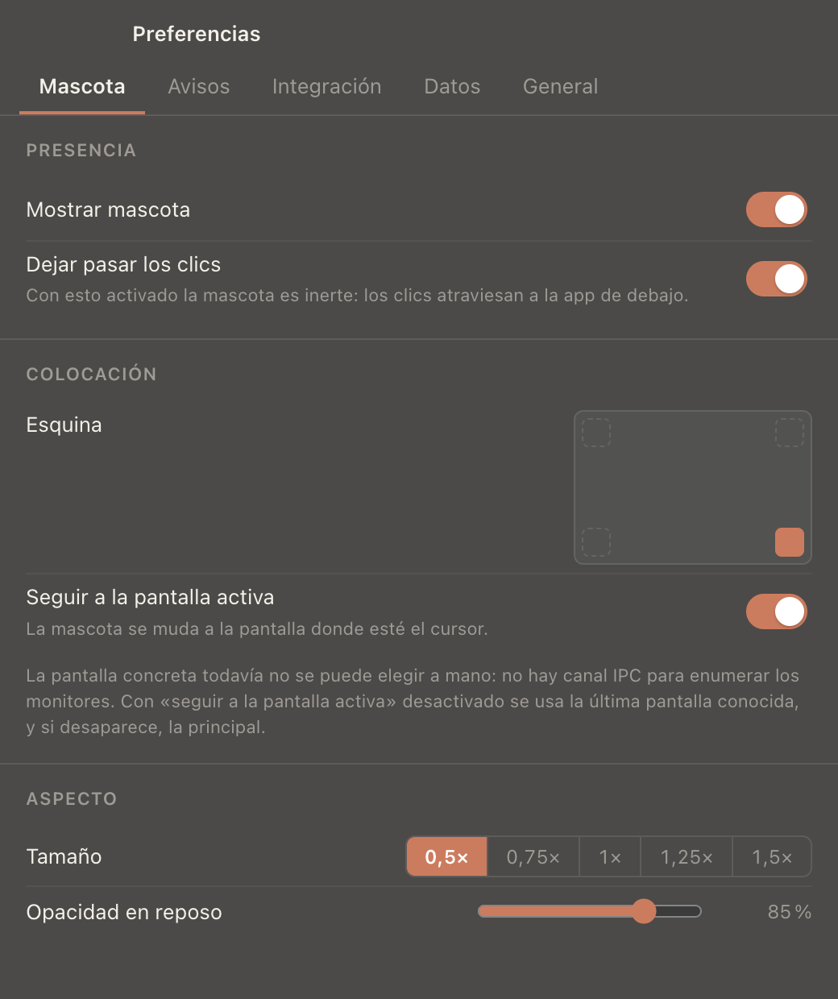
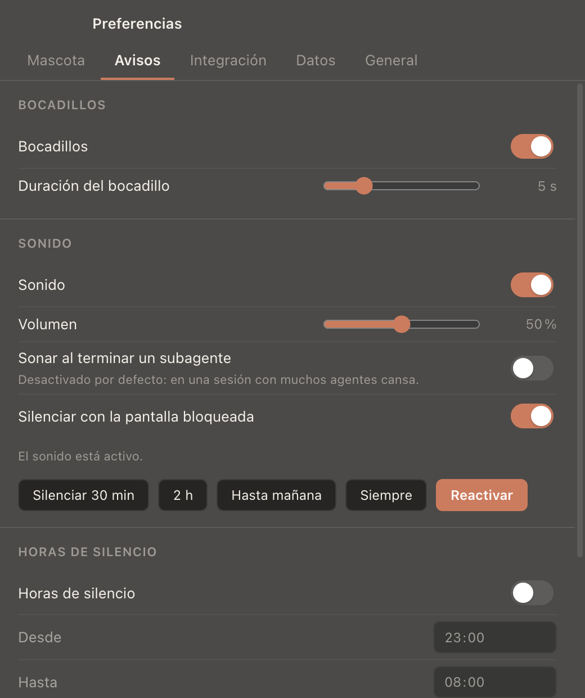
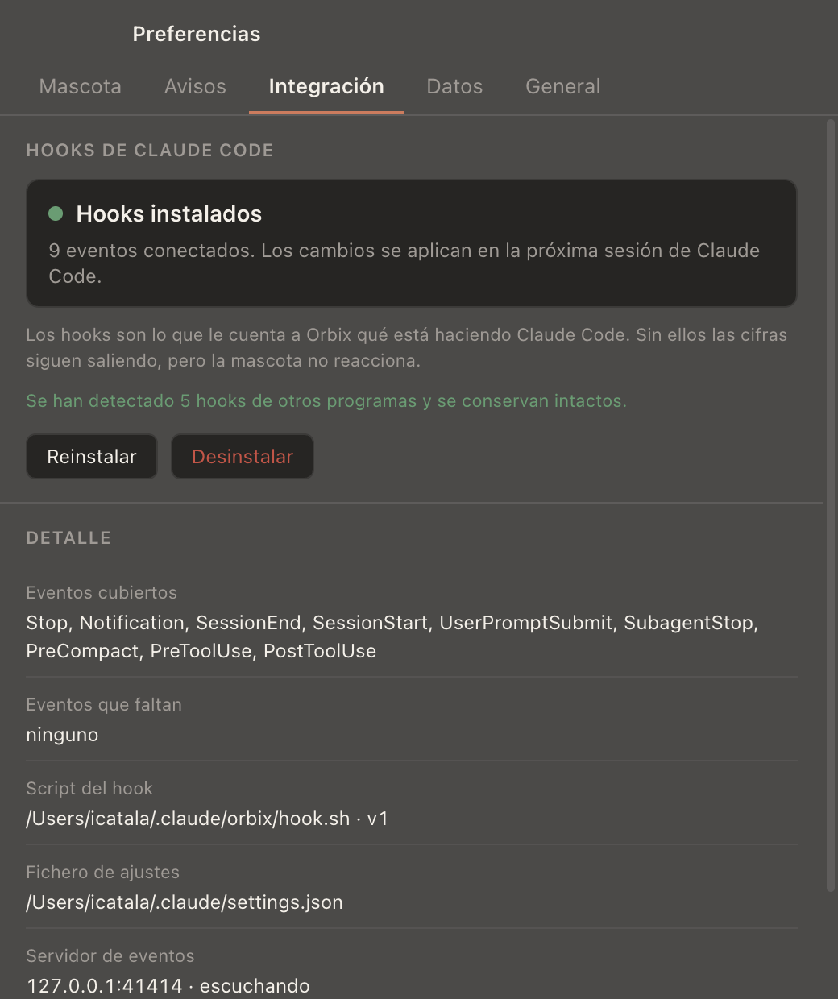
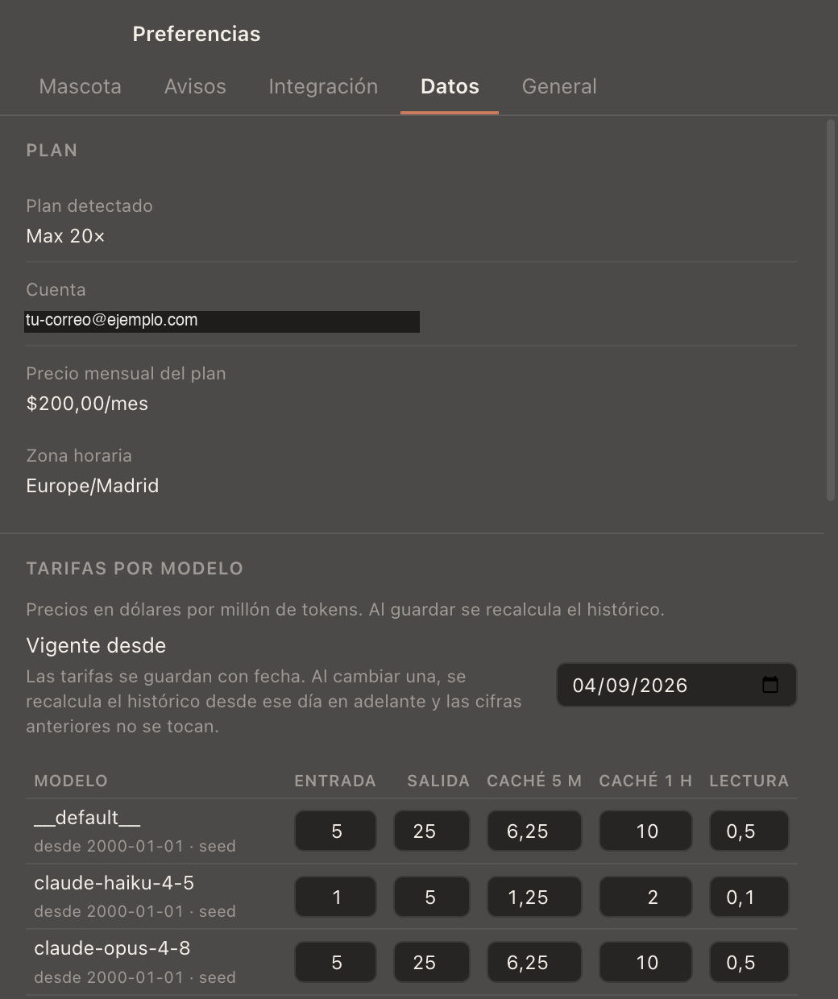
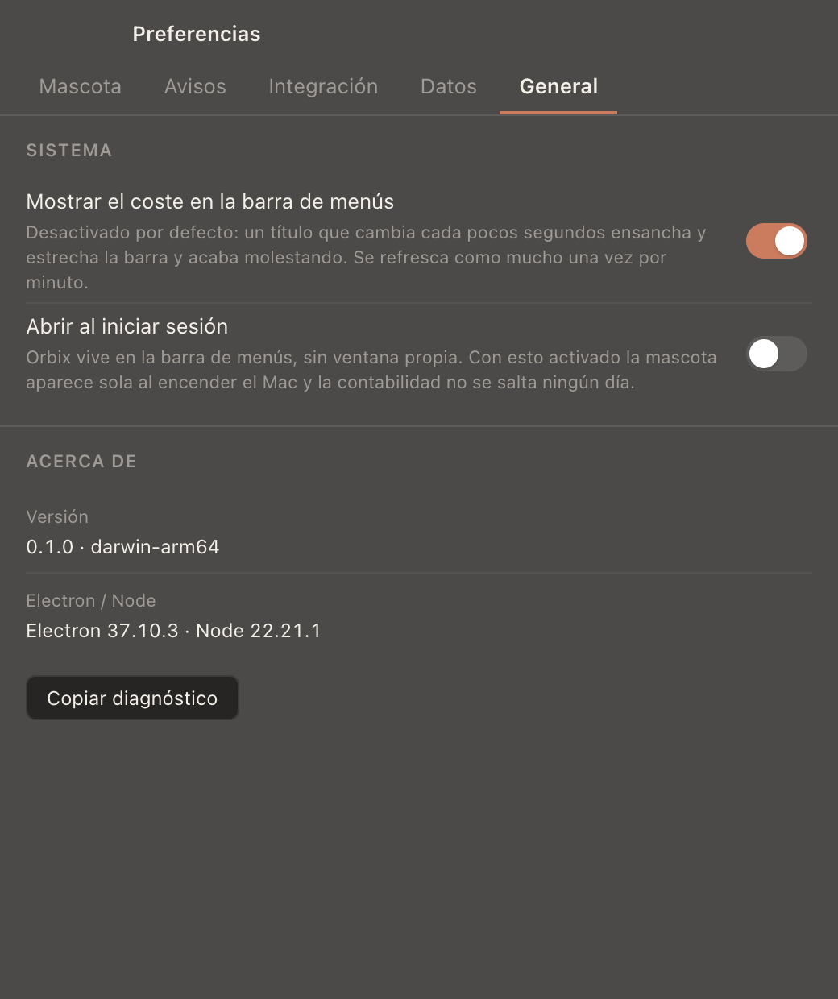

# Manual de usuario de Orbix

Guía completa de instalación y uso. Para una introducción rápida, ver el [README](../../README.md).

## Índice

1. [Instalación](#1-instalación)
2. [Primer arranque](#2-primer-arranque)
3. [La mascota](#3-la-mascota)
4. [El menubar](#4-el-menubar)
5. [Preferencias](#5-preferencias)
6. [Panel de Estadísticas](#6-panel-de-estadísticas)
7. [Desinstalar](#7-desinstalar)
8. [Solución de problemas](#8-solución-de-problemas)

---

## 1. Instalación

### Con Homebrew (recomendado)

```sh
brew install --cask elrincondeisma/orbix/orbix
```

### Con el DMG

1. Descarga la última versión desde la [página de Releases](https://github.com/elrincondeisma/orbix/releases).
2. Abre el DMG y arrastra `Orbix.app` a `Aplicaciones`.
3. Ábrela. Orbix **no está firmado con un certificado de Apple Developer ID** todavía, así que la primera vez macOS puede avisar de que no puede comprobar quién la hizo. Es el comportamiento normal para software independiente sin ese certificado — haz **clic derecho sobre `Orbix.app` → Abrir**, y confirma en el diálogo que aparece. Solo hace falta la primera vez; a partir de ahí se abre con normalidad.

### Requisitos

- macOS 13 (Ventura) o superior, en un Mac con Apple Silicon.
- [Claude Code](https://claude.com/claude-code) instalado.

---

## 2. Primer arranque

Al abrir Orbix por primera vez aparecen dos cosas: la mascota, en la esquina inferior de tu pantalla, y un icono en la barra de menús de macOS. Detrás, sin que tengas que hacer nada, Orbix ya ha empezado a leer tu histórico de Claude Code (los transcripts que guarda en `~/.claude/projects`) para calcular tokens y coste.

Eso es todo lo que hace falta para que **cuente**. Para que la mascota también **reaccione** en tiempo real a lo que hace Claude Code, tienes que instalar los hooks — ver [§5.3 Integración](#53-integración).

---

## 3. La mascota

Vive en una esquina de tu pantalla, es completamente inerte por defecto (los clics la atraviesan) y cambia de tinte, ritmo y bocadillo según lo que Claude Code esté haciendo. No necesita que la mires: de un vistazo por el rabillo del ojo ya sabes si está trabajando, si ha terminado, o si te necesita.

| | |
|---|---|
|  | **En reposo.** Ni bocadillo ni actividad — Claude Code no está haciendo nada ahora mismo. |
|  | **Escribiendo código.** Tinte azul-violeta, mientras Claude edita o crea ficheros. |
|  | **Ejecutando comandos.** Tinte turquesa, mientras corre algo en la terminal. |
|  | **Te necesita.** Tinte dorado, con el mensaje real de Claude Code en el bocadillo — por ejemplo, cuando pide tu permiso para algo. Este es el único estado que no desaparece solo. |
|  | **Terminado.** Tinte verde: el agente principal ha acabado su turno y te está esperando. |

Además de estos cinco, la mascota distingue **pensando** (blanco-plata), **coordinando un agente** (cuando delega en un subagente), **compactando memoria**, **error** (cuando falla una herramienta) y **dormida** (tras un rato largo sin actividad). Cuando trabajas rápido, el bocadillo siempre muestra lo último — no se queda encolado varios segundos por detrás de la realidad.

Los subagentes (los que lanza el propio Claude Code para repartirse el trabajo) cambian el tinte de forma ambiental, pero **no** sueltan bocadillo ni sonido — solo te avisa de verdad el agente principal.

---

## 4. El menubar

Haz clic en el icono de la barra de menús para abrir el resumen.

### 4.1 Sesión actual, hoy, 7 días, 30 días


El bloque de arriba muestra la sesión de Claude Code más reciente que sigue activa: su coste equivalente a tarifas de API, los tokens totales, y el proyecto. Debajo, el mismo coste agregado para hoy, los últimos 7 días y los últimos 30. La etiqueta de tu plan (aquí, **Max 20×**) aparece siempre arriba a la derecha.

### 4.2 Retorno de tu plan

Debajo de los periodos hay un número grande con una «×»: **cuánto te rinde lo que pagas**.

Se calcula así: lo que te habrían costado tus últimos 30 días de uso **pagando la API por consumo**, dividido entre lo que pagas al mes por tu suscripción. Un `15×` significa que has consumido el equivalente a 3.000 $ de API con un plan de 200 $/mes.

Dos avisos para no confundirse:

- **No tiene nada que ver con el «20×» del nombre del plan Max 20×.** Ese 20× es solo el nombre comercial (20 veces el uso del plan Pro), no un tope. Tu retorno puede ser 3×, 15× o 40×.
- **El coste en API es equivalente, no real.** Con la suscripción pagas la cuota fija pase lo que pase; ese número es lo que te habrías dejado haciendo lo mismo por la API.

Si llevas menos de 30 días con Orbix instalado verás la línea *«Como mínimo: solo llevamos N días midiendo, no 30»*: el divisor es un mes completo pero los datos aún no, así que el retorno real es mayor que el que ves.

### 4.3 Límites de la suscripción



Barras de tu ventana de 5 horas y tu semana, con la hora exacta de reinicio. **La antigüedad del dato siempre se muestra** ("actualizado hace...") porque Claude Code no refresca este número constantemente — si lleva mucho tiempo sin hacerlo, Orbix te lo dice con todas las letras en vez de enseñarte un porcentaje que ya no es real. Ver [§5.4 Nivel B](#54-nivel-b-refresco-automático) para tenerlo siempre al día.

---

## 5. Preferencias

Accede desde el menú de la barra de menús. Tiene cinco pestañas.

### 5.1 Mascota



- **Mostrar mascota / Dejar pasar los clics** — enciende o apaga la mascota, o hazla clicable si algún día quieres interactuar con ella directamente.
- **Esquina** — en qué rincón de la pantalla vive.
- **Seguir a la pantalla activa** — si tienes varios monitores, se muda a donde esté el cursor.
- **Tamaño** — de 0,5× a 1,5×. El bocadillo nunca se hace ilegible aunque bajes el tamaño del núcleo: tiene su propia escala mínima.
- **Opacidad en reposo** — cuánto se atenúa cuando no pasa nada.

### 5.2 Avisos



- **Bocadillos** — apágalos si prefieres solo el cambio de color, sin texto.
- **Sonido y volumen**, con un interruptor aparte para los subagentes (apagado por defecto: en una sesión con muchos agentes trabajando a la vez, cansa).
- **Silenciar con la pantalla bloqueada** y botones rápidos de silencio temporal (30 min, 2 h, hasta mañana, siempre).
- **Horas de silencio**, para una franja fija del día (por ejemplo, de noche).

### 5.3 Integración



Aquí es donde conectas Orbix con Claude Code de verdad. Al pulsar **Instalar**, Orbix añade un hook a `~/.claude/settings.json` — el mecanismo oficial y documentado de Claude Code para reaccionar a eventos — sin tocar ningún hook que ya tuvieras de otras herramientas: se detectan y se conservan intactos, y se guarda una copia de seguridad de tu configuración antes de escribir nada.

Esta pantalla enseña siempre el estado real: cuántos eventos están conectados, si falta alguno, la ruta exacta del script y del fichero de ajustes, y si el servidor local está escuchando. **Desinstalar** deja `settings.json` exactamente como estaba antes de instalar.

### 5.4 Datos



- **Plan** — el plan de Claude Code que Orbix detectó, la cuenta asociada y su precio mensual (editable si alguna vez no se detecta bien).
- **Tarifas por modelo** — los precios en dólares por millón de tokens que Orbix usa para calcular el coste equivalente. Se guardan con fecha: si cambias una, el histórico anterior no se toca, solo lo que venga después.
- **Base de datos** — dónde vive tu histórico, su tamaño, y botones para forzar una reingesta si alguna vez sospechas que algo no cuadra.

#### Nivel B: refresco automático

Más abajo en esta misma pestaña, un interruptor **"Refrescar los límites por mi cuenta"**. Desactivado por defecto. Al activarlo, Orbix ejecuta periódicamente (cada 20 minutos por defecto) el comando oficial `claude -p "/usage"` para tener el porcentaje de tus límites siempre al día, en vez de depender de que Claude Code decida refrescarlo por su cuenta.

**Cada ejecución consume una petición real de tu suscripción.** Por eso es opcional, y por eso el intervalo mínimo es de un minuto: actívalo solo si de verdad quieres el dato siempre fresco y no te importa ese coste pequeño y predecible.

Ese sondeo se lanza acotado a propósito: en un directorio de trabajo propio y vacío (dentro de `~/Library/Application Support/Orbix`) y sin cargar ninguno de tus servidores MCP. Hasta la 0.1.2 heredaba el directorio de la app — la raíz del disco — y arrancaba ahí una sesión completa de Claude Code con tus MCP; macOS atribuía a Orbix los permisos que pidiera esa sesión, y podías ver a Orbix pidiendo acceso a la fototeca o a otras carpetas protegidas sin tener nada que ver con ellas. Si te salió ese aviso y lo denegaste, no hace falta que cambies nada: Orbix nunca ha necesitado ese permiso.

### 5.5 General



- **Mostrar el coste en la barra de menús** — un contador junto al icono, si lo prefieres visible sin necesidad de abrir el popover.
- **Mostrar el % de la ventana de 5 h en la barra de menús** — el porcentaje que llevas gastado del límite que aprieta mientras trabajas (no el semanal). Con las dos opciones activadas, junto al icono verás `$56 · 43 %`. Si el dato de límites lleva más de un día sin refrescarse el porcentaje desaparece en vez de mentirte: pasa el ratón por encima del icono para verlo con su antigüedad.
- **Abrir al iniciar sesión** — para que la mascota aparezca sola al encender el Mac y no se salte ningún día de contabilidad.
- **Acerca de** — versión de Orbix, de Electron y de Node, y un botón para copiar un diagnóstico si algún día necesitas reportar un problema.

---

## 6. Panel de Estadísticas


Accesible desde el menubar, con más detalle que el popover: coste y tokens por periodo (hoy, 7 días, 30 días, este mes, todo), el retorno de tu plan (ver [§4.2](#42-retorno-de-tu-plan)), una gráfica diaria, y el desglose completo por proyecto y por modelo.

Cuando tu histórico cubre menos de 30 días —lo normal nada más instalar, porque Claude Code borra sus propios transcripts pasado ese plazo— el multiplicador se marca como **suelo**: la cifra real solo puede ser igual o mayor, nunca menor.

---

## 7. Desinstalar

1. **Preferencias → Integración → Desinstalar.** Esto devuelve `~/.claude/settings.json` a como estaba antes de que instalaras Orbix.
2. Arrastra `Orbix.app` a la papelera.
3. Tu histórico en `~/Library/Application Support/Orbix` no se borra solo. Si no lo necesitas, bórralo a mano; si algún día vuelves a instalar Orbix, seguirá ahí.

---

## 8. Solución de problemas

**"Orbix no se puede abrir porque Apple no puede comprobar que no contiene malware".**
Normal en la primera apertura de una app sin certificado de Apple Developer ID. Clic derecho sobre `Orbix.app` → Abrir → Abrir de todos modos. Solo hace falta una vez.

**La mascota no reacciona a nada, pero el menubar sí cuenta tokens.**
Le faltan los hooks. Ve a Preferencias → Integración e instálalos — es un paso aparte y deliberado, para que Orbix nunca toque tu configuración de Claude Code sin tu confirmación explícita.

**Los porcentajes de límites llevan mucho tiempo sin cambiar.**
Es el comportamiento normal de Claude Code: ese dato solo se refresca cuando él decide hacerlo, a veces con días de diferencia. Ejecuta `/usage` en cualquier sesión de Claude Code para forzarlo, o activa el Nivel B (§5.4) para que Orbix lo haga solo cada 20 minutos.

**Dos instancias a la vez.**
Orbix detecta si ya hay otra copia escuchando en el mismo puerto y se cierra sola, dejando un aviso en el registro con el PID de la que sigue viva. No hace falta hacer nada: la mascota y el menubar siguen funcionando con la instancia original.
